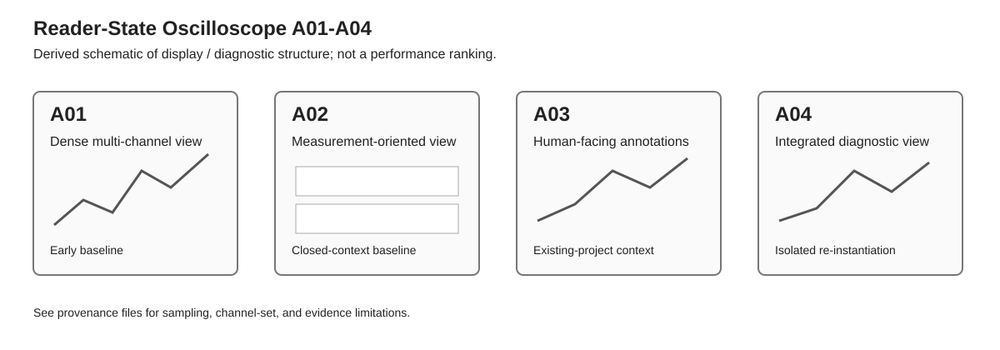

# Figures

## A01–A04 display / diagnostic structure comparison

This SVG is a **derived schematic**, not a screenshot of the original PDFs and not a quantitative performance chart.

It is intended to make differences in display / diagnostic information architecture visible at a glance:

- A01: dense all-channel overview;
- A02: more explicit measurement-oriented overview;
- A03: stronger human-facing event labeling and commentary;
- A04: integrated overview with explicit diagnostic and state-boundary information.

The left-to-right arrangement is chronological. It must **not** be read as a scalar quality axis or as proof that each later run is better.

For exact source identity and page selection, see [PROVENANCE_A01_A04.md](../PROVENANCE_A01_A04.md).  
For experimental-condition limitations, see [CONDITIONS_PROVENANCE_A01_A04.md](../../CONDITIONS_PROVENANCE_A01_A04.md).
